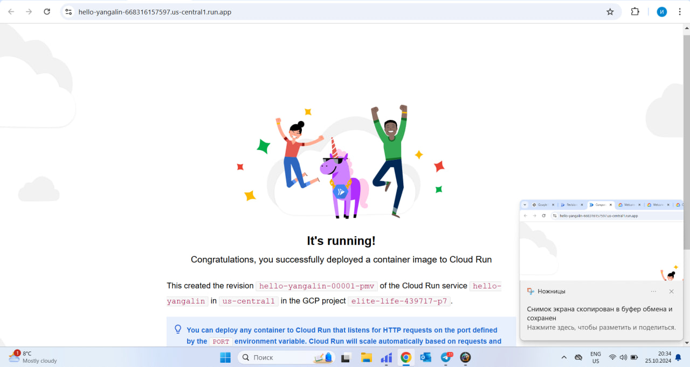

# ITMO University
## Faculty of FICT  
**Course**: Cloud platforms as the basis of technology entrepreneurship  
**Year**: 2023/2024  
**Group**: R4225
**Author**: Yangalin Islam Azamatovich
**Lab**: Lab1  
**Date of creation**: 25.10.2024
**Date of defense**: 25.10.2024

---

## Цель работы

Развертывание сервиса на Google Cloud Run с минимально возможными ресурсами. Тестирование работы сервиса, анализ логов и метрик, изменение конфигурации порта, переключение трафика между разными ревизиями и сравнение их работы. По завершении необходимо удалить все созданные ресурсы.

---

## Ход выполнения работы

### 1. Создание и деплой сервиса на Cloud Run

1. Открыл **Google Cloud Console** и перешел в раздел **Cloud Run**. В разделе нажал на кнопку "Create service" для создания нового сервиса.
2. В поле **Container image URL** ввел путь к образу контейнера `us-docker.pkg.dev/cloudrun/container/hello`. Это стандартный образ контейнера, который возвращает сообщение "Hello World" при обращении к сервису.  
   Скриншот: 

3. В поле **Service name** указал имя сервиса — `hello-yangalin`.
4. Выбрал регион **us-central1 (Iowa)** для развертывания сервиса.
5. В разделе **CPU allocation and pricing** выбрал опцию "CPU is only allocated during request processing", чтобы снизить расходы. Эта опция гарантирует, что ресурсы будут выделяться только в момент обработки запроса, а не постоянно.  
   Скриншот: 

6. В разделе **Service scaling** указал минимальное количество экземпляров — **0**. Это означает, что контейнеры не будут активны, когда нет запросов, что дополнительно снижает расходы. Это может приводить к "cold starts", когда первый запрос занимает больше времени для обработки.

7. В разделе **Ingress control** выбрал опцию **All**, чтобы сделать сервис доступным из интернета для всех пользователей без необходимости аутентификации.

8. Нажал на кнопку **Create** и начал деплой сервиса.  
   Скриншот: 

### 2. Тестирование развернутого сервиса

1. После успешного деплоя сервис предоставил публичный URL для доступа к нему. Перешел по этому URL в браузере и убедился, что сервис работает и возвращает сообщение "Hello World".  
   Скриншот: 

2. Сервис был развернут с минимальными ресурсами, но демонстрировал хорошую производительность. Это показало, что для простых приложений, таких как Hello World, достаточно минимальных настроек ресурсов.

### 3. Анализ логов и метрик

#### 3.1 Логи
1. Перешел в раздел **Logs** в Google Cloud Console, чтобы посмотреть логи запросов к сервису. Все запросы обрабатывались успешно, ошибок в логах не было. Логи включали данные о каждом запросе, его задержке и коде ответа.

#### 3.2 Метрики
2. Перешел в раздел **Metrics**, чтобы проанализировать ключевые показатели работы сервиса.  
Основные метрики, которые были проанализированы:
   - **Request count**: количество запросов к сервису.
   - **Request latency**: задержка обработки запросов.
   - **Container startup latency**: время, необходимое для запуска контейнера, когда сервис получает новый запрос. Это особенно важно для контейнеров с минимальным количеством инстансов (0), так как они должны стартовать при первом запросе.

3. **Анализ Request Latency**:
   - В среднем задержка обработки запросов составила **5-10 мс**. Это очень хороший показатель, особенно учитывая, что сервис работает на минимальных ресурсах (128MB памяти и 1 vCPU). Такой уровень задержки говорит о том, что сервис способен быстро обрабатывать запросы, даже в условиях минимальной конфигурации.
   
4. **Анализ Container Startup Latency**:
   - Время старта контейнера составило **64-68 мс**. Данный показатель относится к так называемым "cold starts" — когда минимальное количество инстансов установлено на 0, контейнер должен стартовать при первом запросе. Задержка при старте контейнера может быть критичной для приложений, которые требуют мгновенной доступности. Однако для простого тестового сервиса вроде "Hello World" это время вполне приемлемо. В случае более сложных приложений можно рассмотреть установку минимального числа инстансов, чтобы избежать холодных стартов.

5. **Максимальное количество одновременных запросов**:
   - Сервис обрабатывал до 2 одновременных запросов во время тестов. Это ожидаемый результат для небольшой нагрузки и демонстрирует способность Cloud Run динамически масштабировать инстансы при увеличении числа запросов.

   Скриншоты:
   -  — Графики задержки запросов и количества запросов.
   -  — Метрики задержки, включая данные о максимальных одновременных запросах и времени старта контейнера.

### 4. Изменение порта и управление версиями

1. **Изменение порта**:
   - Открыл настройки ревизии сервиса и создал новую ревизию с измененным портом на **8090**. 
   - Однако, контейнер по умолчанию настроен на прослушивание порта 8080, и после изменения порта на 8090 сервис перестал отвечать на запросы. Это подтвердило, что сервисы, использующие образ `hello`, настроены для работы на порте 8080, и при изменении порта необходимы дополнительные изменения в конфигурации контейнера.

2. **Управление версиями (ревизиями)**:
   - Создал новую ревизию сервиса, вернув порт на **8080**.
   - Настроил переключение трафика между двумя ревизиями: 50% трафика направил на первую ревизию с портом **8080**, а 50% — на вторую ревизию с портом **8090**.
   - После этого провел тестирование: трафик корректно распределялся между ревизиями, хотя сервис на порте 8090 не работал. Это продемонстрировало возможность гибкого управления версиями в Cloud Run.  
  

### 5. Удаление ресурсов

1. После завершения всех тестов удалил созданный сервис, чтобы не было дополнительных расходов. Для этого в разделе **Cloud Run** выбрал созданный сервис и нажал **Delete**.

---

## Заключение

В ходе лабораторной работы был успешно создан и развернут сервис в **Google Cloud Run** с минимальными настройками ресурсов.  
Анализ метрик показал, что даже с минимальными ресурсами, сервис может демонстрировать высокую производительность, особенно с точки зрения задержки обработки запросов и времени старта контейнера. Однако стоит учитывать, что при установке минимального количества инстансов в 0 возможны "cold starts", что увеличивает время отклика на первый запрос. В таких случаях можно рассмотреть настройку минимального числа инстансов больше 0 для обеспечения мгновенной доступности.

Изменение порта на **8090** не дало ожидаемого результата, так как контейнер был настроен на прослушивание порта **8080**. Это подтвердило необходимость правильной настройки контейнеров для работы с нестандартными портами.

Управление версиями (ревизиями) и распределение трафика между ними показало высокую гибкость Google Cloud Run. Это позволяет легко тестировать разные версии приложения и постепенно внедрять изменения, не прерывая работу основного сервиса.

