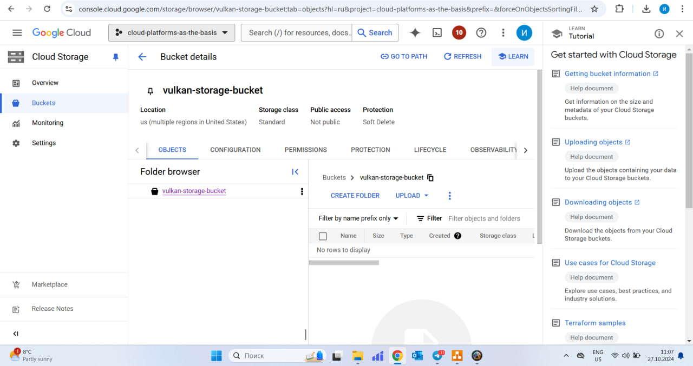
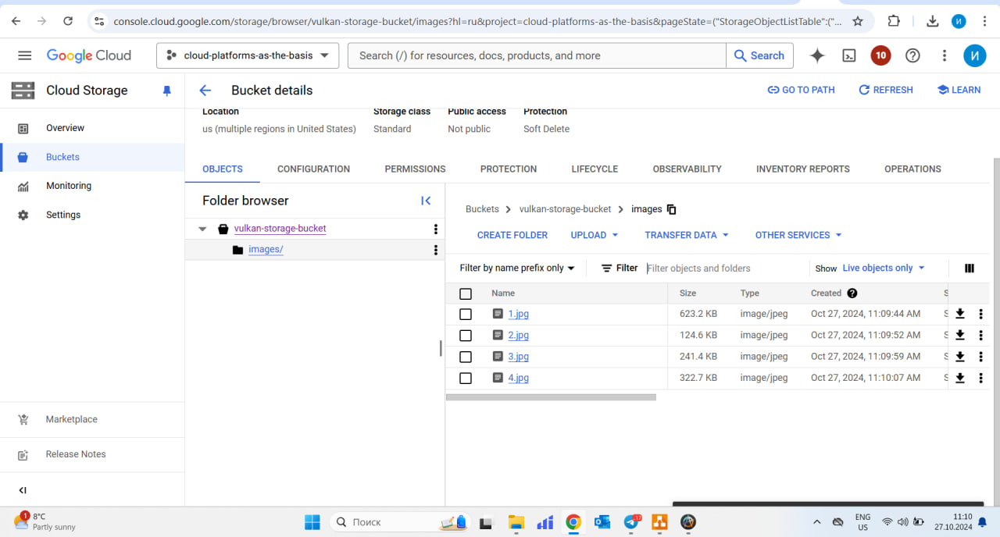
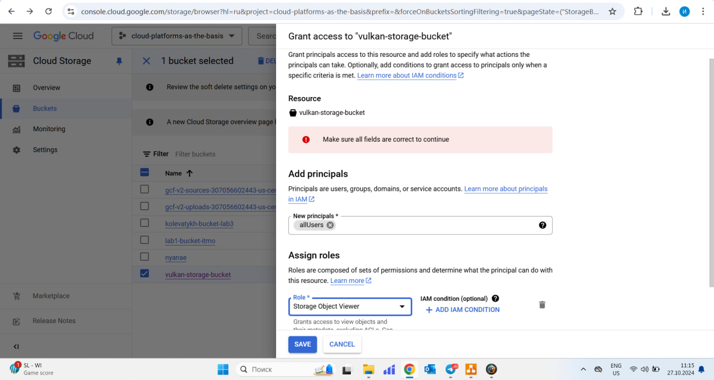

# Лабораторная работа №3: "Исследование Cloud Storage"

## Описание

Это третья лабораторная работа курса "Облачные платформы как основа технологического предпринимательства", посвящённая исследованию возможностей Cloud Storage.

## Цель работы

- Ознакомиться с основными понятиями и принципами работы облачного хранилища.
- Изучить различные модели хранения данных (блок, файл, объектное хранилище).
- Познакомиться с основными сервисами и функционалом, предоставляемым облачными хранилищами.

## Ход работы

### 1. Выбор проекта
Войдя в Google Cloud Console, был выбран существующий проект с необходимыми разрешениями. На главной панели я убедился, что работаю в проекте с ID cloud-platforms-as-the-basis.

### 2. Создание Cloud Storage Bucket
Для хранения данных был создан бакет vulkan_storage-bucket с настройками по умолчанию.

### 3. Загрузка файлов в Cloud Storage
Я загрузил 4 изображения в созданный бакет.

### 4. Создание папки
Затем я создала папку с названием images и переместила все загруженные изображения в эту папку.

### 5. Настройка публичного доступа
Для того чтобы мои файлы были доступны публично, я изменил настройки приватности на уровне бакета. Я назначила роль Storage Object Viewer для всех пользователей (allUsers), чтобы открыть доступ к файлам.

После этого я смог создать публичные ссылки на файлы.

### 6. Проверка публичного доступа
Для проверки я открыл одну из созданных публичных ссылок и убедился, что файл доступен.

### 7. Удаление созданных сервисов
После завершения работы я удалил созданные бакеты и освободил ресурсы, чтобы избежать лишних затрат.

## Результаты лабораторной работы

В результате данной работы я изучил основные возможности Cloud Storage:
- Научился создавать бакеты и загружать в них данные.
- Научился управлять папками и файлами в пределах бакета.
- Изучил процесс предоставления публичного доступа к файлам через Cloud Storage.
- Настроил ссылки для публичного доступа к файлам.

## Выводы

- Гибкость управления данными: Google Cloud Storage предоставляет гибкие возможности для управления файлами и их структурой.
- Простота настройки доступа: Настройка публичного доступа через Cloud Storage позволяет легко и безопасно делиться файлами.
- Эффективность работы с данными: Возможности работы с папками и перемещения файлов внутри бакета делают Cloud Storage удобным инструментом для хранения и организации данных.
